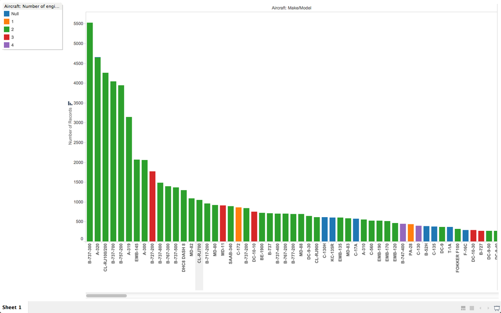

# Report

Using Tableau, create visualization for each question in the report regarding
bird strikes.

# Authors

This report is prepared by
* [Karen Blakemore](https://github.com/kjblakemore)
* [Brian McKean](https://github.com/co-bri)
* [Mingqi Lew](https://github.com/Malaokia)
* [Matt Schroeder](https://github.com/mattschroeder97)
* [Dian Ding](https://github.com/boanding)

# What airports have the most expensive average accident?

This question was asked by willzfarmer.

The leftmost barchart in orange shows the airports with the most expensive average.

# Which airport has the most bird hits?

This question was asked by zhya215.

The bubble are set by size showing Denver with most bird strike incident reports.

# Which airline incurs the most repair cost due to damage?

This question was asked by sumi6109.

Picture of the repair cost.

# Which plane model strikes the most birds?

This question was asked by twagar95.

The chart above shows the ranking of birdstrikes by aircraft make/model.    
