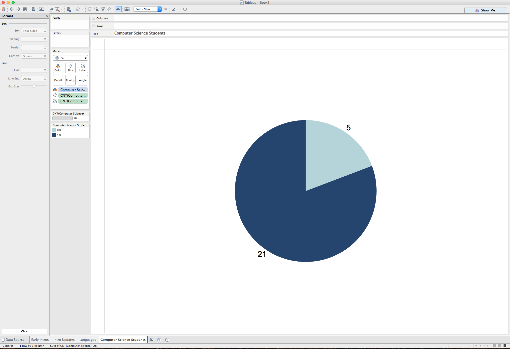
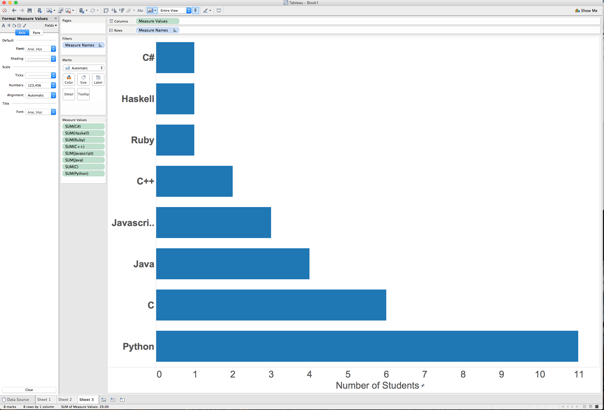
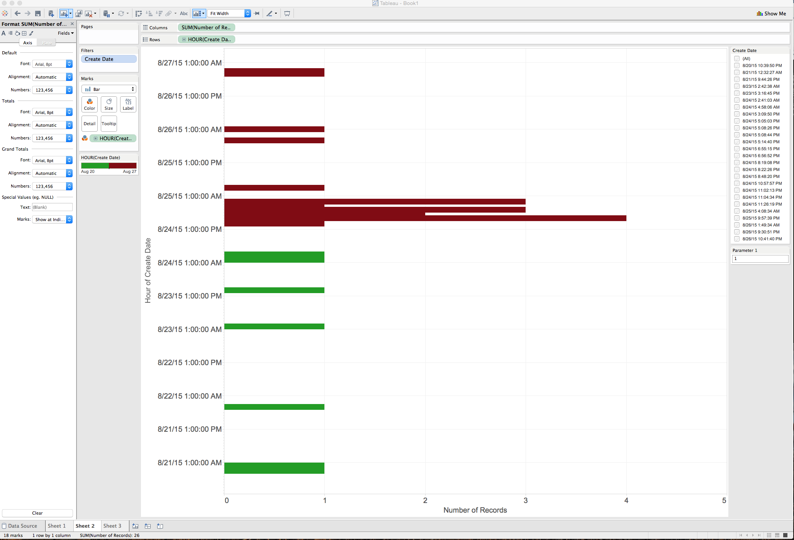
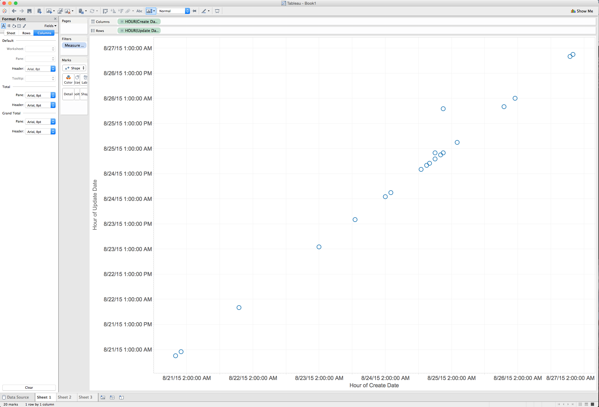

# Tableau Visualization

Tableau is arguably the biggest deal now in terms of data visualization for non-programmers.
Let's pretend you are not a programmer. Learn and experience what it is like to make
visualizations using Tableau to answer the same questions about your classmates in our course.

For each of the questions, think about what chart you should use to convey your answer and
make your best effort to create something that makes sense to you. There's no right
or wrong. When we meet in the class again, we will set aside time for each team to discuss
and compare the variety of visualization solutions each member has come up with for the
same set of questions. It will be fun!

To include a Tableau visualization in your report, take a screenshot, save it as an image,
put it in the `learning/week2` folder, and replace ``  with
your own image. Please makes sure your screenshot includes the _entire_ Tableau interface
including the controls, widgets ...etc.

# How big the deal Tableau really is?

According to a July 2015 article in [Forbes Investing](http://www.forbes.com/sites/greatspeculations/2015/07/08/mid-year-review-tableau-goes-from-strength-to-strength/), Tableau Software is in the business analytics market which is composed of computer and database vendors, such as IBM, MicroSoft and Oracle, as well as independent software vendors like Tableau and Qlik. Tableau recently formed a strategic alliance with Splunk.  In this alliance, Splunk provides collection and management of unstructured data.  Tableau provides the visualization and data discovery.

Tableau's customer base grew from 4,400 in 2010 to 26,000 in 2014, with an additional 2,600 customers in the first quarter of 2015.  Forbes expects the customer base to expand to 35,000 by the end of 2015 and to 65,000 through 2018.

# What percentage of students are CS majors?

The chart shows that 21 students are CS majors or are practicing computer scientists, whereas 5 students have other majors.

# What are the popular languages?

The chart shows the ranking of language popularity from least popular to the most popular.

# How many students created their introduction prior to the first class meeting?

The bars are color-coded to distinguish between introductions made before and after the first class which met on Augist 24th at 10 AM UTC.  In total, 7 students introduced themselves before the first class.

# How many students updated their comments?

The graph plots dates for the creation of introductions against the update dates.  Students who did not update their introductions are represented as points on the diagonal.  There are two points that fall above the diagonal, representing the two students who updated their comments.
