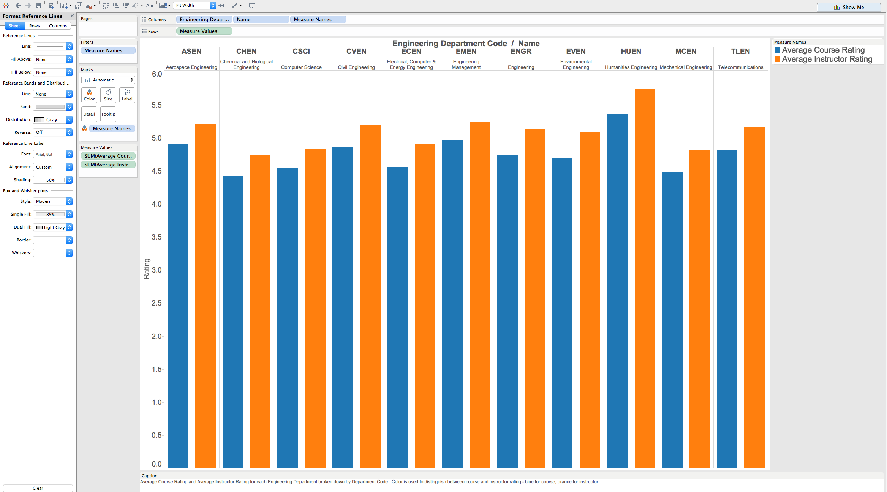
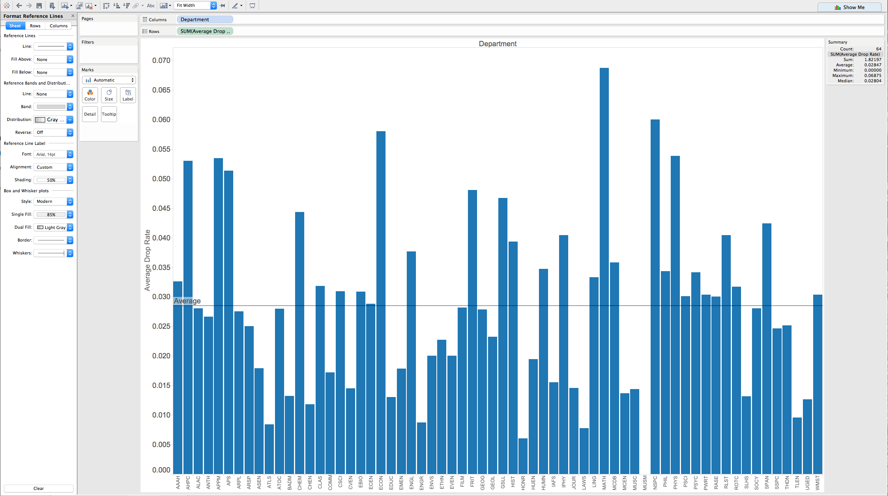
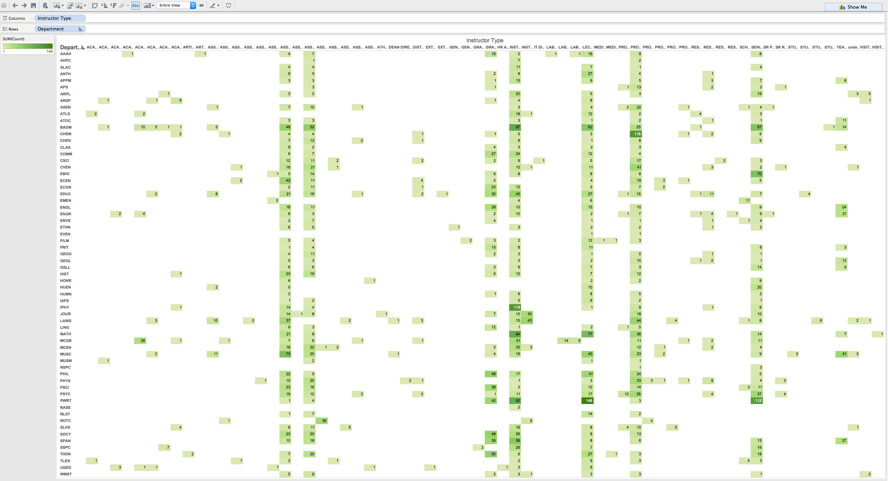
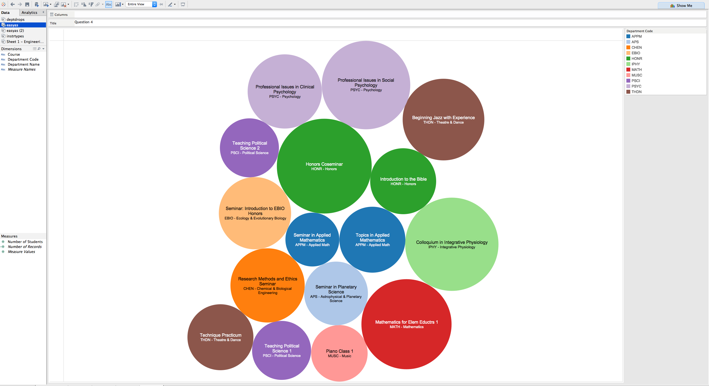
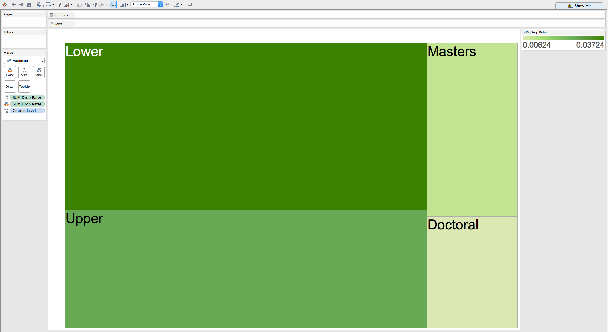

# Visualization

Using Tableau, create visualization for each question in the report. You will
work on this independently just like last week.

To include a Tableau visualization in your report, take a screenshot, save it as an image,
put it in the `learning/week4` folder, and replace ``  with
your own image. Please makes sure your screenshot includes the _entire_ Tableau interface
including the controls, widgets ...etc.

# Import

Data: [fcq.clean.json](https://github.com/bigdatahci2015/book/blob/master/hackathons/fcq/fcq.clean.json)

This dataset is provided to you in the JSON format. Your first task is to figure out
how to transform this JSON file into a format that can be fed into Tableau. As
a junior and senior, you are expected to be able to look around the Internet
to problem solve.

# How do the course and instructor ratings compare across engineering departments?

This chart shows how students rated their engineering courses and instructors, as measured by the FCQ reports in the data set.  The ratings were averaged across students and departments. The average ratings are all in approximately the top 25% of the 0-6 scale.  The average instructor ratings are higher than the average course ratings.  The lowest rated department is MCEN (Mechanical Engineering).  The highest rated department is HUEN (Humanities Engineering).

# How does student course drop rate compare across departments?

Above, you can see the distribution of course drop rate across departments.  The drop rate ranges from 0 for the Museum classes, to 6.9% for Math classes, with an average and median of 2.8%.

# What is the distribution of instructor type across departments?

The distribution of instructor type across departments is shown in the chart, above.  The vertical axis is the Department and the horizontal is the Instructor Type.  Entries in the chart are the number of instructors of that particular type who taught during the semesters represented in the FCQ data set, with the color shade indicating the number of instructors.  The vertial bands show that the highest number of instructors have titles of Instructor (957), Lecturer (761), Professor (700), Associate Professor (619), Senior Instructor (579) and Assistant Professor (488).

# Which classes have the highest GPA with the least amount of time spent each week?

The diagram displays the courses in which all students received a 4.0 grade and required no more than 3 hours of work each week.  The color indicates the department, as shown in the upper right hand corner.  The size of the bubble corresponds to the number of students in the class and ranges from a maximum of 31 in the "Honors Coseminar" to 10 in the "Seminar in Applied Mathematics".

# What is the course drop rate across course levels?

The course drop rate varies from a high of 3.7% for the lower level courses, to a low of .6% for Doctoral Level Courses.  This is shown in the diagram, where the size and shade of the blocks indicates the drop rate. 
